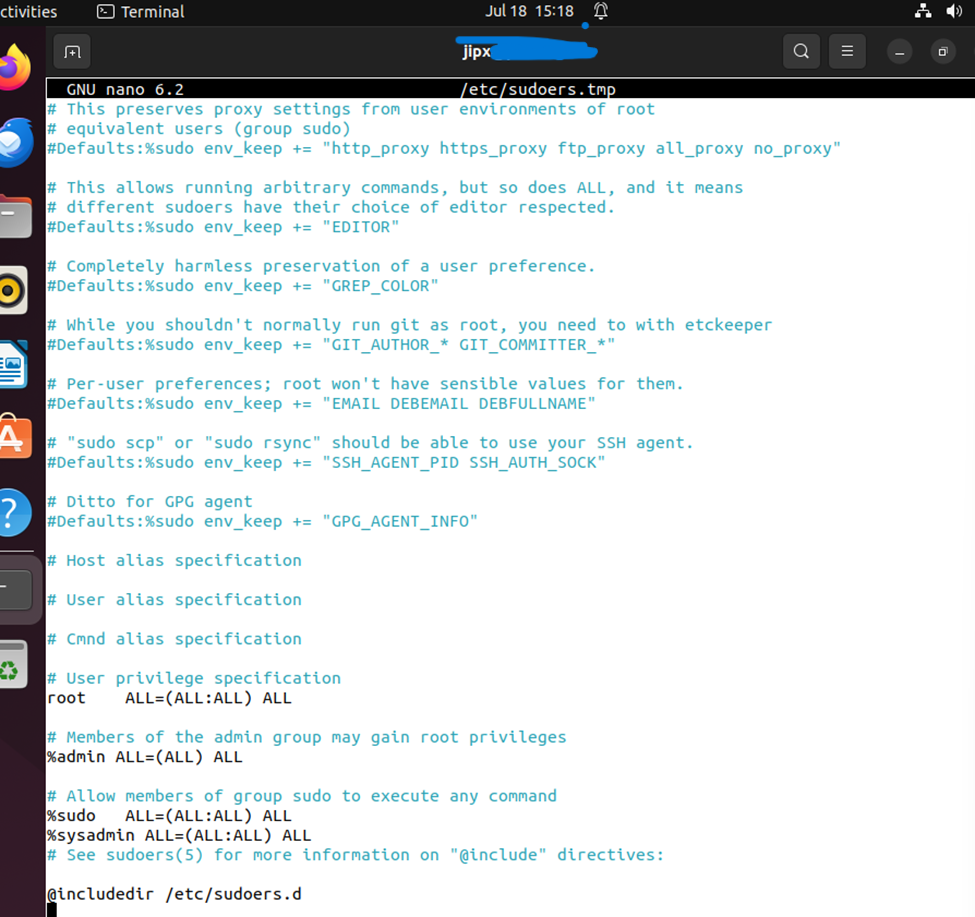
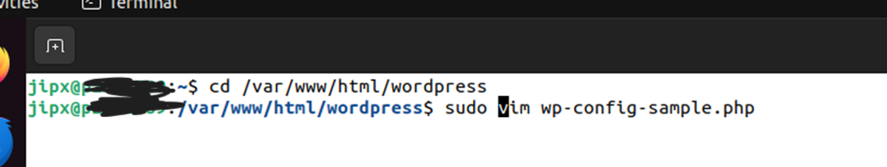
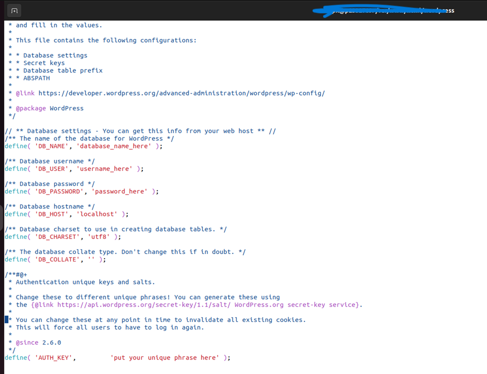
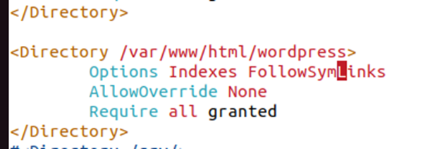
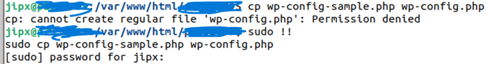

## Task 1
Using the VM image from practical 9, I had to first set the vm's hostname to my admin number
```
sudo hostnamectl set-hostname "adminNO"
```

close the current terminal and open a new one, you should be greeted with a terminal that says something like this:
```
jipx@adminNO
```

## Task2
Install APache web server, php and mysql:
```
sudo apt install php php-cli php-mysql php-json php-opcache php-mbstring php-xml php-gd php-curl mysql-server apache2
```

Enabling and starting the daemons:
```
sudo systemctl enable mysql
sudo systemctl start mysql
sudo systemctl start apache2
```

## Task 3
Create Groups and Permissions (remember to configure password if needed):
```
sudo groupadd sysadmin
sudo groupadd webdev
sudo adduser sysadminuser1 --ingroup sysadmin
sudo adduser sysadminuser2 --ingroup sysadmin
sudo adduser webdevuser1 –-ingroup webdev
sudo adduser webdevuser2 –-ingroup webdev
```

Setting up the right perms for the group:
```
sudo visudo
```

append (to give sysadmin group the ability to sudo):
```
%sysadmin ALL=(ALL:ALL) ALL
```

## Task 4
Installing wordpress:
```
sudo wget https://wordpress.org/latest.tar.gz
```
Extracting the package:
```
tar -xvf latest.tar.gz
```
copy everythin over to `/var/www/html`:
```
sudo cp -r wordpress /var/www/html
```
cd to `wordpress` and edit configurations:


<br> Edit it so you achieve this:
```
define('DB_NAME', 'wordpress-db-adminNO');
define('DB_USER', 'wordpress-user-adminNO');
define('DB_PASSWORD', 'adminNO');
```
Changing the owner of the file to `www-data:www-data`
```
sudo chown -R www-data:www-data /var/www/html/wordpress
```
Give rxw to `wordpress`:
```sudo chmod -R 775 /var/www/html/wordpress```

Configure apache and wordpress:
```
cd /etc/apache2
```

edit `apache2.conf`:

restart apache:
```
sudo systemctl restart apache
```

Move files and copy sample:

<br>

Create database:
```
sudo mysql -u root -p
```
In mysql console:
```
mysql> CREATE USER 'wordpress-user-adminNO'@'localhost' IDENTIFIED BY 'adminNO';
mysql> CREATE DATABASE `wordpress-db-adminNO`; ## need to use backticks
mysql> GRANT ALL PRIVILEGES ON `wordpress-db-adminNO`.* TO 'wordpress-user-adminNO'@'localhost';
mysql> FLUSH PRIVILEGES;
mysql> SELECT user,authentication_string,plugin,host FROM mysql.user;
mysql> quit;
```

Once you are done:
reboot:
```
reboot
```

Open firefox and go to:<br>
http://127.0.0.1/adminNO/wp-admin/setup-config.php<br>
select ENGLISH(US) <br>
Add in your details <br>
```
site Title: anythin
username: wordpress-user-adminNO
password: adminNO
enter your email
```
click install wordpress.<br>


for monitoring logs:
```
tail -n 20 /var/log/syslog
tail -n 20 /var/log/auth.log
tail -n 20 /var/log/apache2/access.log
tail -n 20 /var/log/apache2/error.log
tail -n 20 /var/log/mysql/error.log
```

## Task 5
go to http://127.0.0.1/adminNO/wp-admin/index.php for more configs.<br>
## Task 6
## Task 7